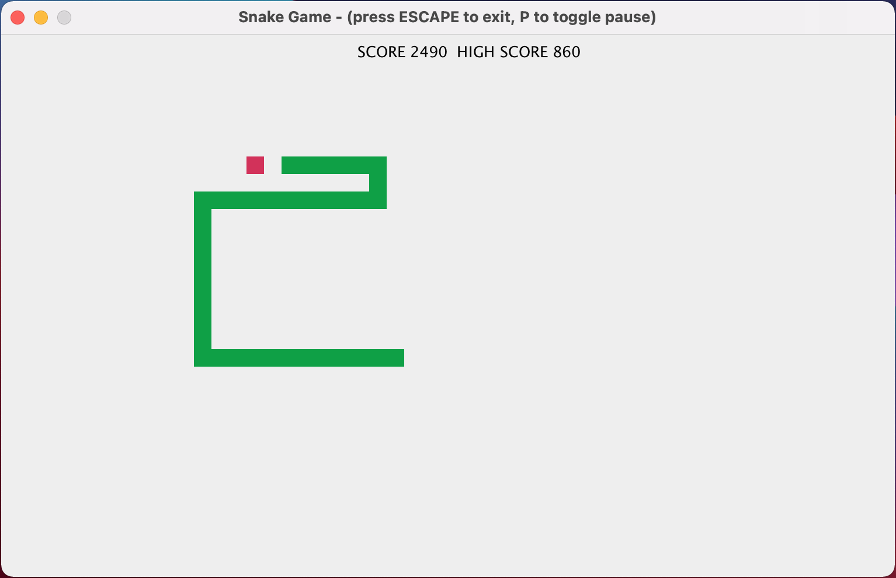

# clojure-snake



`clojure-snake` is a simple implementation of the snake game written in Clojure and Swing. The [original implemention](https://github.com/somi92/clojure-snake) was developed by Milos Stojanovic approximately 7 years ago at the time of writing.

My original intention was to merely improve my understanding of Clojure by analysing a real application. However, this intention gradually expanded such that my version is: simplified (by removing the AI handling, removing and updating dependencies, plus merging files), expanded (the board is larger and the snake smaller), and extended (by adding extra features such as scoring and progressively increasing the game speed) to enhance game play.

## Compilation and Usage

In you are feeling in the mood and assuming that [Java](https://openjdk.java.net/) and [Leiningen](https://leiningen.org/) are installed on your machine, run the 

```
lein uberjar
```

command to create a standalone jar file. The resulting exectuable is created in a `target/uberjar` directory, which can be invoked using the command:
```
java -jar clojure-snake-0.1.0-standalone.jar -s <speed>
```
The optional parameter <speed> specifies the snake's initial speed and it must be an integer in the range 0 (slow) and 40 (fast).

Alternatively, the latest [release](https://github.com/blogscot/snake-game/releases) can be downloaded directly and ran using the aforementioned command. 

Enjoy!